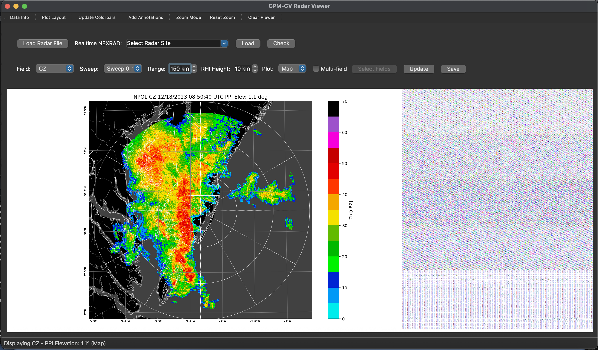
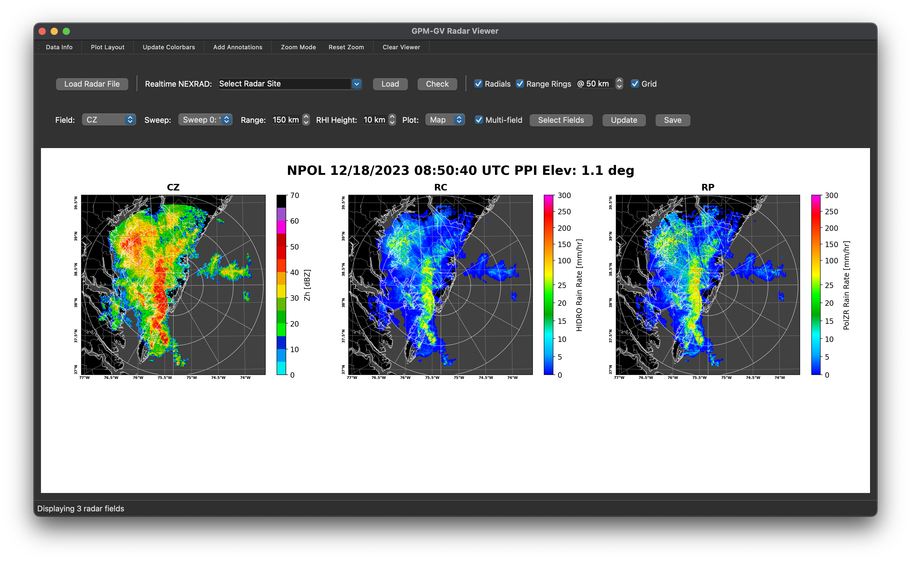
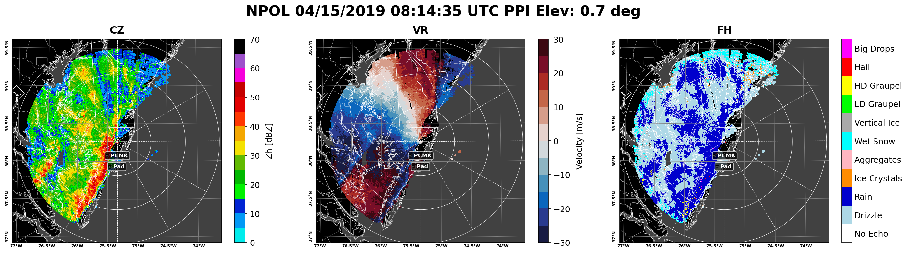
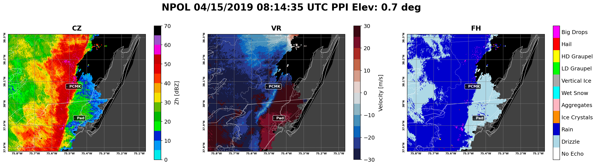
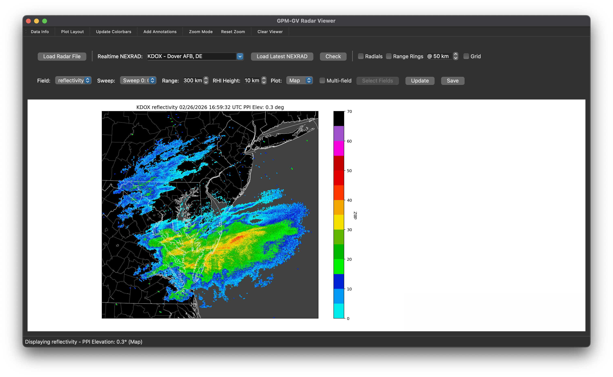
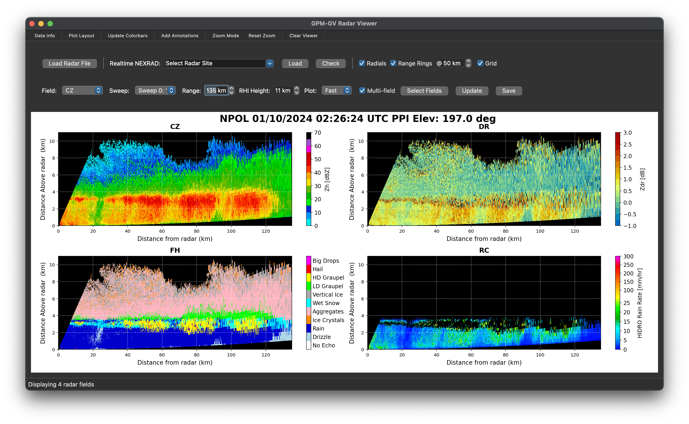
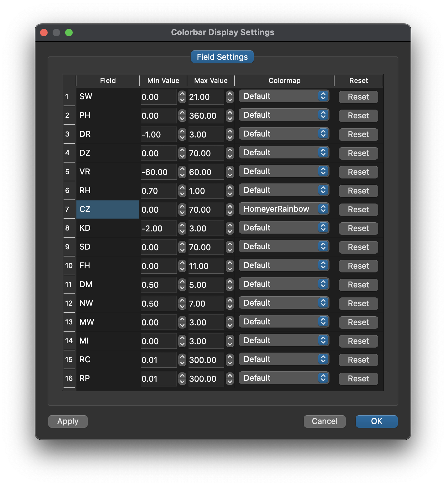
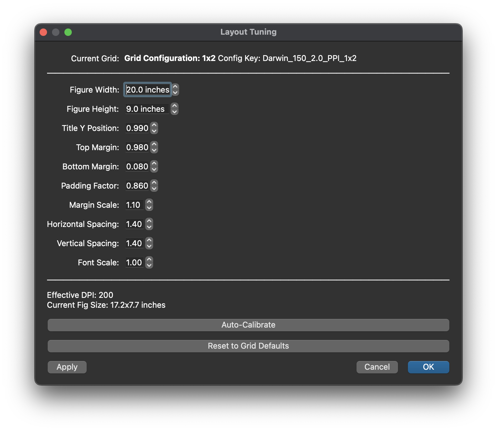

# GVview - GPM Ground Validation Radar Viewer

A professional, interactive radar data visualization tool built for the NASA GPM Ground Validation program. GVview provides advanced analysis and visualization capabilities for weather radar data with support for multiple formats and real-time NEXRAD data access.

---

## ✨ Features

### 📊 **Data Format Support**
- **NEXRAD Level II** - Real-time download and visualization from NOAA servers
- **ODIM H5** - European weather radar standard
- **GAMIC HDF5** - Research radar data format
- **D3R** - Dual-frequency Dual-polarized Doppler Radar
- **PyART Grid** - Gridded radar data products
- **xarray Datasets** - NetCDF/HDF gridded data
- **CfRadial** - Climate and Forecast conventions
- **Auto-format detection** - Intelligently detects and loads various formats

### 🎯 **Visualization Modes**
- **PPI (Plan Position Indicator)** - Horizontal cross-sections
- **RHI (Range Height Indicator)** - Vertical cross-sections
- **Fast Mode** - Quick x-y plotting without map projection
- **Map Mode** - Geographic projection with Cartopy integration
- **Multi-field Display** - View up to 9 fields simultaneously

### 🛠️ **Interactive Tools**
- **Zoom Tool** - Click-and-drag box zoom with real-time rectangle preview
- **Annotations** - Add custom markers and labels to plots
- **Field Selector** - Easy switching between radar variables
- **Sweep Selector** - Navigate through elevation angles or vertical levels
- **Range Control** - Adjustable maximum range (10-500 km)
- **Height Control** - Configurable max height for RHI plots (1-25 km)

### 📋 **Metadata**
- **Data Info Button** - View Metadata

### 🎨 **Customization**
- **Colorbar Settings** - Custom colormaps, min/max values per field
- **Auto-detection** - Smart range detection for unknown fields using percentiles
- **Layout Tuning** - Fine-tune figure size, margins, spacing, and fonts
- **Platform Optimization** - Automatic DPI and layout scaling for Windows/macOS/Linux
- **Persistent Settings** - Save preferences across sessions

### 🗺️ **Map Features**
- **High-resolution Shapefiles** - US states, counties, coastlines
- **Natural Earth Data** - International boundaries and features
- **Custom Projections** - Lambert Conformal projection centered on radar
- **Grid Lines** - Lat/lon grid with customizable spacing
- **Terrain Features** - Lakes, rivers, and ocean display

### 📡 **NEXRAD Integration**
- **Real-time Download** - Fetch latest scans from 160+ NEXRAD sites
- **Site Checker** - Verify site availability and data status
- **Split-cut Merging** - Automatically combine reflectivity and velocity scans
- **Comprehensive Site List** - All US, Puerto Rico, Guam, and international sites

---

## 📦 Dependencies
### Required Python Packages

* python >= 3.7
* numpy >= 1.19.0
* matplotlib >= 3.3.0
* pyqt5 >= 5.15.0
* arm-pyart >= 1.12.0
* netCDF4 >= 1.5.0
* xarray >= 0.16.0
* h5py >= 3.0.0
* cartopy >= 0.18.0
* shapely >= 1.7.0
* requests >= 2.25.0
* cftime >= 1.3.0

## Installation

### Option 1: Conda Environment (Recommended)

    git clone https://github.com/jlpippitt/GVview.git
    cd GVview

    conda create -n gvview python=3.9
    conda activate gvview

    conda install -c conda-forge arm_pyart
    conda install -c conda-forge pyqt
    conda install -c conda-forge cartopy

    pip install pillow requests cftime

### Option 2: pip Installation

    git clone https://github.com/jlpippitt/GVview.git
    cd GVview

    python -m venv gvview-env
    source gvview-env/bin/activate

    pip install -r requirements.txt

### Optional: Shapefile Setup

    County shapefiles are included as `shape_files.zip`. Extract them:

    # After cloning the repo
    unzip shape_files.zip

## Usage

### Basic Usage

    conda activate gvview
    chmod +x GVview.py
    ./GVview.py

### Quick Start Guide

#### 1. Load Local File
- Click Load Radar File
- Select your radar file
- File format is auto-detected

#### 2. Download NEXRAD Data
- Select site from dropdown
- Click Load to download latest scan
- Click Check to verify site status

#### 3. Visualize Data
- Select field from dropdown
- Choose sweep/elevation angle
- Toggle between Fast and Map plotting modes

#### 4. Multi-field Display
- Check Multi-field checkbox
- Click Select Fields
- Choose multiple fields to display

#### 5. Zoom and Pan
- Click Zoom Mode in toolbar
- Click and drag on plot to draw zoom box
- Release to apply zoom
- Click Reset Zoom to return to full view

#### 6. Save Plot
- Click Save button
- Choose output filename
- Plot saved as high-resolution PNG

## Screenshots

### Map Mode with Geographic Features

*High-resolution map overlay with state boundaries, counties, and custom annotations*

### Multi-Field Display

*1x3 grid display showing CZ (Corrected Reflectivity [dBZ]), RC (HIDRO Rain Rate [mm/hr]), and RP (PolZR Rain Rate [mm/hr])*

### Interactive Zoom Tool

*Click-and-drag zoom box with real-time preview (Top: before zoom, Bottom: after zoom)*

### NEXRAD Real-Time Download

*Real-time NEXRAD Level II data download with site selector and status checker*

### RHI Plotting

*Range-Height Indicator showing vertical structure of precipitation*

### Custom Colorbar Settings

*Per-field customization of data ranges and colormaps*

### Layout Tuning

*Fine-tune figure dimensions, margins, spacing, and fonts*

---

*Note: Screenshots are for demonstration purposes. Your actual display may vary based on radar data and platform.*

## Configuration

### Layout Tuning

Access via Layout button in toolbar:
- Figure Size
- Margins
- Title Position
- Spacing
- Font Scale
- Auto-Calibrate

### Colorbar Settings

Access via Colorbar button in toolbar:
- Min/Max Values
- Colormap selection
- Reset to defaults

### Annotations

Access via Annotations button in toolbar:
- Add Points
- Labels
- Symbols
- Colors
- Quick Add radar location

## Troubleshooting

### Common Issues

Could not load file
- Ensure file format is supported
- Check for corrupted files
- Try decompressing files manually
- Check file permissions

NEXRAD download failed
- Check internet connection
- Verify site code is correct
- Some sites may be temporarily offline
- Try Check button to verify site status

Plots are too small/large
- Use Layout button to adjust figure size
- Try Auto-Calibrate for automatic optimization
- Adjust padding factor

Zoom rectangle is laggy
- Use Fast mode for smoother interaction
- Reduce number of displayed fields
- Throttling automatically optimizes updates

Colorbar does not match data
- Reset field settings via Colorbar dialog
- Check for masked/missing data
- Try auto-detection
- Verify data range using Data Info dialog

## Acknowledgments

- NASA GPM Ground Validation - Funding and support
- Py-ART - ARM Radar Toolkit for data I/O and processing
- NOAA - NEXRAD data and site information
- Cartopy - Geospatial plotting capabilities
- PyQt5 - GUI framework

## Contact

- GitHub Issues: Report bugs or request features
- Email: jason.l.pippitt@nasa.gov

## Documentation

### Additional Resources
- Py-ART Documentation: https://arm-doe.github.io/pyart/
- NEXRAD Data Archive: https://www.ncdc.noaa.gov/nexradinv/
- Cartopy Documentation: https://scitools.org.uk/cartopy/
- PyQt5 Tutorial: https://www.riverbankcomputing.com/static/Docs/PyQt5/

### Radar Data Formats
- CfRadial Standard: https://github.com/NCAR/CfRadial
- ODIM H5 Specification: https://www.eumetnet.eu/odim/
- NEXRAD Level II Format: https://www.ncdc.noaa.gov/data-access/radar-data/nexrad

## Version History

### v1.0.0
- Initial release
- Multi-format radar data support
- Interactive PPI/RHI visualization
- NEXRAD real-time download
- Zoom and annotation tools
- Custom colorbar settings
- Multi-field display
- Auto-detection of unknown fields

## Citation

If you use GVview in your research, please cite:

Jason Pippitt, 2026. GVview: GPM Ground Validation Radar Viewer. 
GitHub repository, https://github.com/jlpippitt/GVview

---
